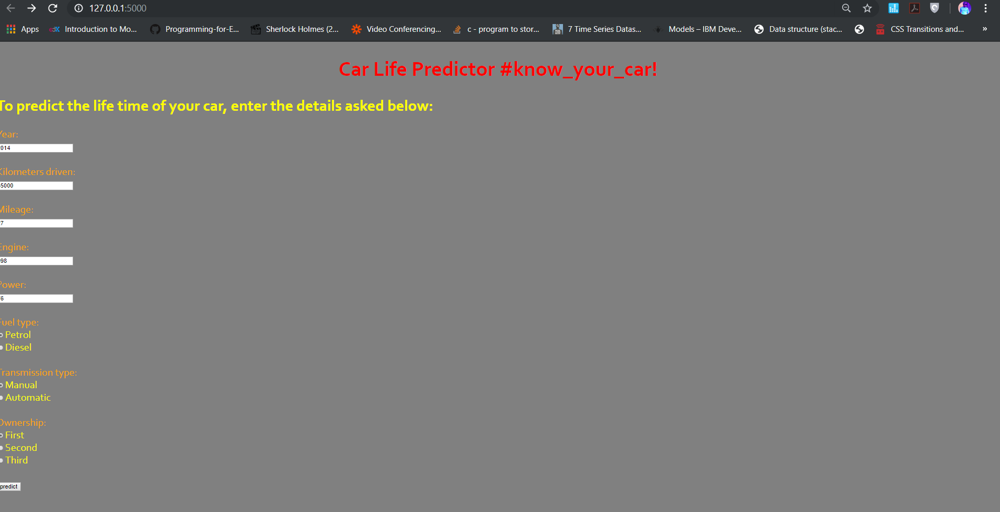
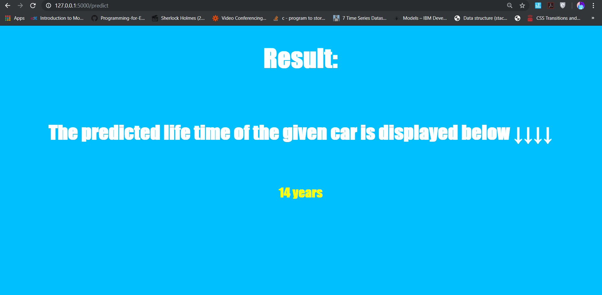
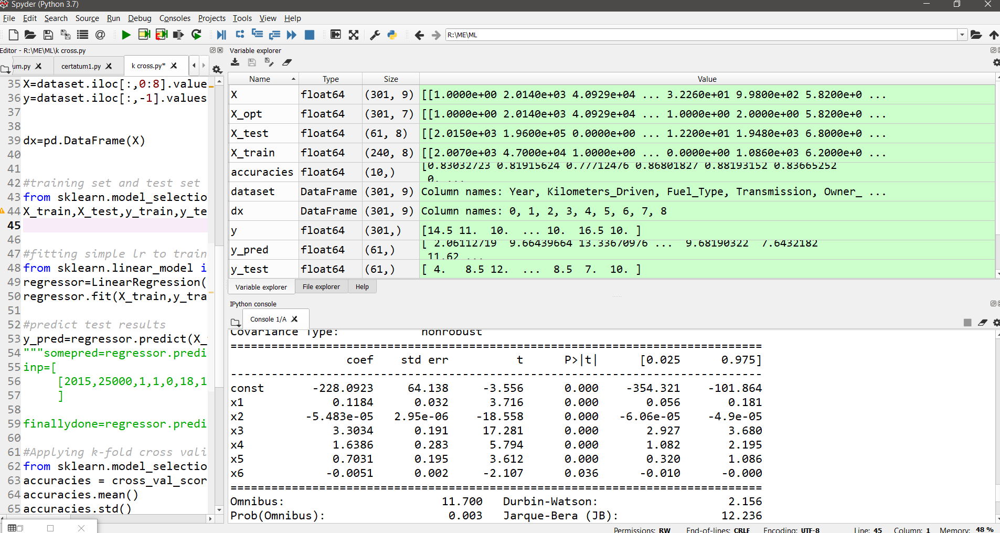
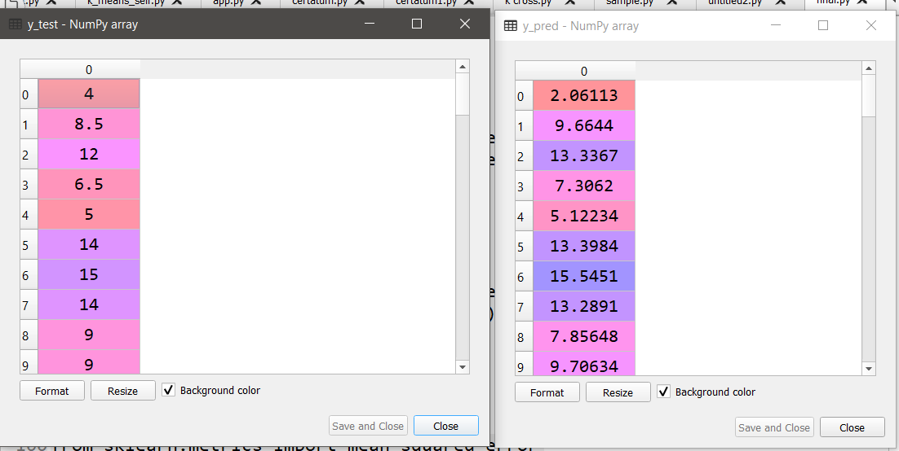
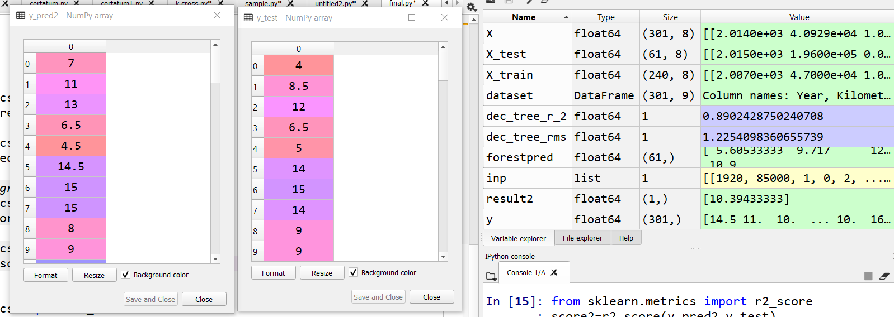
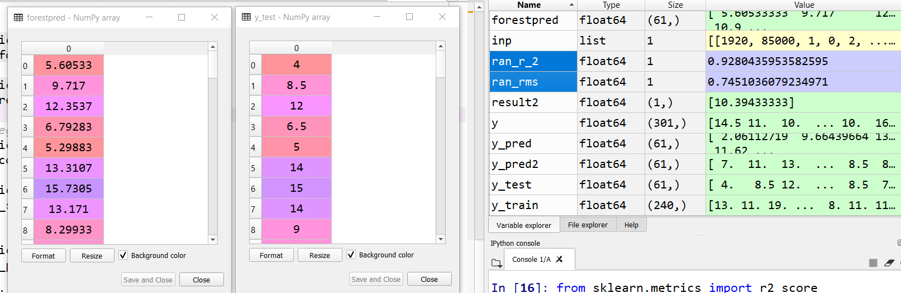

# STRs_Expo - Product Lifecycle Forecasting

## Car Lifecycle Predictot

Below are some images related to the project:

## Problem Statement

The lifecycle of car parts has significantly decreased over the past three decades, creating a demand for accurate predictions of part lifespans. This project aims to leverage machine learning to predict the lifecycle of car parts, enabling the identification of replacement parts or new manufacturers for obsolete components.

## Introduction

As per the European Commission, a 50% increase in transportation is expected over the next 20 years, potentially leading to a capacity crunch due to infrastructure limitations. This project aims to develop a system capable of detecting wear in car parts based on usage data and vehicle characteristics, predicting the remaining useful lifetime of these parts.

## Proposed Solution

We propose creating a machine learning model that can be integrated into a web-based platform, usable by both individuals and companies. The model will predict the remaining useful lifetime of a vehicle by comparing its current state (derived from a dataset) to an expected state (calculated using a mathematical model of wear). Key characteristics such as fuel type, mileage, and kilometers driven will be used for this comparison.

## Methodology

The project utilizes a dataset obtained from Kaggle, which includes various features of used cars in India. The dataset contains information on parameters such as the year of the vehicle, fuel type, transmission, ownership, mileage, power, and kilometers driven. The dependent variable in this study is the vehicle's grade, which correlates with its expected lifetime.

### Parameters

- **Independent Variables:**
  - Year of the vehicle
  - Fuel type
  - Mileage
  - Kilometers driven
  - Ownership
  - Transmission
  
- **Dependent Variable:**
  - Vehicle grade

The vehicle grade determines the expected lifetime of the car, categorized as follows:
- Grade A: 17-20 years
- Grade B: 13-16 years
- Grade C: 10-12 years
- Grade D: 7-9 years
- Grade E: 4-6 years

### Techniques Used

The initial approach involves using Multiple Regression to predict the vehicle grade. 

The model's performance will be validated by visualizing the fit using scatter plots. If the fit is not satisfactory, alternative techniques such as clustering or random forest regression may be considered.

## After Fitting the Model

Post model fitting, a graph will be plotted to assess the accuracy of the model against the independent variables. The aim is to ensure that the model accurately predicts the vehicle's life grade based on the given data.

## Tech Stack Used

### Tools:
- **Model Creation:**
  - Anaconda Python
  - Spyder
- **Presentation:**
  - HTML
  - CSS

### Libraries:
- **NumPy:** For large multi-dimensional arrays and matrices, along with mathematical functions.
- **Matplotlib:** For plotting and embedding plots into applications.
- **Pandas:** For data manipulation and analysis.
- **Sklearn:** For machine learning tasks such as classification, regression, and clustering.

## Business Impact

The proposed approach for estimating the remaining useful lifetime of vehicles can be integrated into onboard equipment across various industries, including automotive and aviation. This will help reduce maintenance and repair costs by enabling timely service scheduling. Additionally, car manufacturers can use this model to predict the lifespan of new vehicles based on their characteristics, which can enhance their brand reputation and profitability.

## Results

Below are the results related to the project:

## Conclusion

The STRs_Expo project provides a practical solution for predicting the lifecycle of car parts, potentially revolutionizing the way vehicle lifespans are assessed and managed. This model can significantly impact both individual users and the automotive industry, leading to more sustainable and cost-effective practices.
